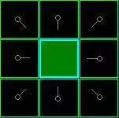
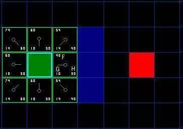
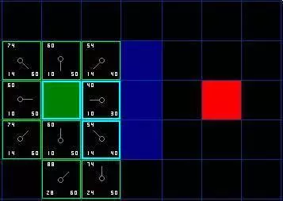
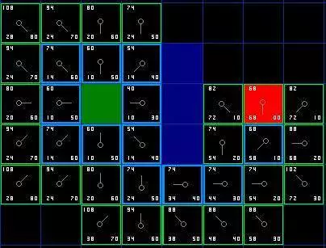
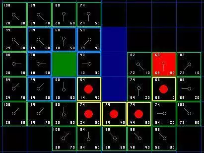

http://blog.vckbase.com/panic/archive/2005/03/20/3778.html
# A*寻路初探
原文：Patrick Lester
翻译：Panic 
2005年3月18日
原文出处：A* Pathfinding for Beginners
## 译者序
很久以前就知道了A*算法，但是从未认真读过相关的文章，也没有看过代码，只是脑子里有个模糊的概念。这次决定从头开始，研究一下这个被人推崇备至的简单方法，作为学习人工智能的开始。
这篇文章非常知名，国内应该有不少人翻译过它，我没有查找，觉得翻译本身也是对自身英文水平的锻炼。经过努力，终于完成了文档，也明白的A*算法的原理。毫无疑问，作者用形象的描述，简洁诙谐的语言由浅入深的讲述了这一神奇的算法，相信每个读过的人都会对此有所认识（如果没有，那就是偶的翻译太差了--b）。
以下是翻译的正文。(由于本人使用ultraedit编辑，所以没有对原文中的各种链接加以处理(除了图表)，也是为了避免未经许可链接的嫌疑，有兴趣的读者可以参考原文。
会者不难，A*(念作A星)算法对初学者来说的确有些难度。
这篇文章并不试图对这个话题作权威的陈述。取而代之的是，它只是描述算法的原理，使你可以在进一步的阅读中理解其他相关的资料。
最后，这篇文章没有程序细节。你尽可以用任意的计算机程序语言实现它。如你所愿，我在文章的末尾包含了一个指向例子程序的链接。 压缩包包括C++和Blitz Basic两个语言的版本，如果你只是想看看它的运行效果，里面还包含了可执行文件。
我们正在提高自己。让我们从头开始......
## 序：搜索区域
假设有人想从A点移动到一墙之隔的B点，如下图，绿色的是起点A，红色是终点B，蓝色方块是中间的墙。

你首先注意到，搜索区域被我们划分成了方形网格。像这样，简化搜索区域，是寻路的第一步。这一方法把搜索区域简化成了一个二维数组。数组的每一个元素是网格的一个方块，方块被标记为可通过的和不可通过的。路径被描述为从A到B我们经过的方块的集合。一旦路径被找到，我们的人就从一个方格的中心走向另一个，直到到达目的地。
这些中点被称为“节点”。当你阅读其他的寻路资料时，你将经常会看到人们讨论节点。为什么不把他们描述为方格呢？因为有可能你的路径被分割成其他不是方格的结构。他们完全可以是矩形，六角形，或者其他任意形状。节点能够被放置在形状的任意位置－可以在中心，或者沿着边界，或其他什么地方。我们使用这种系统，无论如何，因为它是最简单的。
## 开始搜索
正如我们处理上图网格的方法，一旦搜索区域被转化为容易处理的节点，下一步就是去引导一次找到最短路径的搜索。在A*寻路算法中，我们通过从点A开始，检查相邻方格的方式，向外扩展直到找到目标。
我们做如下操作开始搜索：
从点A开始，并且把它作为待处理点存入一个“开启列表”。开启列表就像一张购物清单。尽管现在列表里只有一个元素，但以后就会多起来。你的路径可能会通过它包含的方格，也可能不会。基本上，这是一个待检查方格的列表。
寻找起点周围所有可到达或者可通过的方格，跳过有墙，水，或其他无法通过地形的方格。也把他们加入开启列表。为所有这些方格保存点A作为“父方格”。当我们想描述路径的时候，父方格的资料是十分重要的。后面会解释它的具体用途。
从开启列表中删除点A，把它加入到一个“关闭列表”，列表中保存所有不需要再次检查的方格。
在这一点，你应该形成如图的结构。在图中，暗绿色方格是你起始方格的中心。它被用浅蓝色描边，以表示它被加入到关闭列表中了。所有的相邻格现在都在开启列表中，它们被用浅绿色描边。每个方格都有一个灰色指针反指他们的父方格，也就是开始的方格。

接着，我们选择开启列表中的临近方格，大致重复前面的过程，如下。但是，哪个方格是我们要选择的呢？是那个F值最低的。
## 路径评分
选择路径中经过哪个方格的关键是下面这个等式：
F = G + H
这里：
G = 从起点A，沿着产生的路径，移动到网格上指定方格的移动耗费。
H = 从网格上那个方格移动到终点B的预估移动耗费。这经常被称为启发式的，可能会让你有点迷惑。这样叫的原因是因为它只是个猜测。我们没办法事先知道路径的长度，因为路上可能存在各种障碍(墙，水，等等)。虽然本文只提供了一种计算H的方法，但是你可以在网上找到很多其他的方法。
我们的路径是通过反复遍历开启列表并且选择具有最低F值的方格来生成的。文章将对这个过程做更详细的描述。首先，我们更深入的看看如何计算这个方程。
正如上面所说，G表示沿路径从起点到当前点的移动耗费。在这个例子里，我们令水平或者垂直移动的耗费为10，对角线方向耗费为14。我们取这些值是因为沿对角线的距离是沿水平或垂直移动耗费的的根号2（别怕），或者约1.414倍。为了简化，我们用10和14近似。比例基本正确，同时我们避免了求根运算和小数。这不是只因为我们怕麻烦或者不喜欢数学。使用这样的整数对计算机来说也更快捷。你不就就会发现，如果你不使用这些简化方法，寻路会变得很慢。
既然我们在计算沿特定路径通往某个方格的G值，求值的方法就是取它父节点的G值，然后依照它相对父节点是对角线方向或者直角方向(非对角线)，分别增加14和10。例子中这个方法的需求会变得更多，因为我们从起点方格以外获取了不止一个方格。
H值可以用不同的方法估算。我们这里使用的方法被称为曼哈顿方法，它计算从当前格到目的格之间水平和垂直的方格的数量总和，忽略对角线方向。然后把结果乘以10。这被成为曼哈顿方法是因为它看起来像计算城市中从一个地方到另外一个地方的街区数，在那里你不能沿对角线方向穿过街区。很重要的一点，我们忽略了一切障碍物。这是对剩余距离的一个估算，而非实际值，这也是这一方法被称为启发式的原因。想知道更多？你可以在这里找到方程和额外的注解。
F的值是G和H的和。第一步搜索的结果可以在下面的图表中看到。F,G和H的评分被写在每个方格里。正如在紧挨起始格右侧的方格所表示的，F被打印在左上角，G在左下角，H则在右下角。

现在我们来看看这些方格。写字母的方格里，G = 10。这是因为它只在水平方向偏离起始格一个格距。紧邻起始格的上方，下方和左边的方格的G值都等于10。对角线方向的G值是14。
H值通过求解到红色目标格的曼哈顿距离得到，其中只在水平和垂直方向移动，并且忽略中间的墙。用这种方法，起点右侧紧邻的方格离红色方格有3格距离，H值就是30。这块方格上方的方格有4格距离(记住，只能在水平和垂直方向移动)，H值是40。你大致应该知道如何计算其他方格的H值了～。
每个格子的F值，还是简单的由G和H相加得到
## 继续搜索
为了继续搜索，我们简单的从开启列表中选择F值最低的方格。然后，对选中的方格做如下处理：
4．把它从开启列表中删除，然后添加到关闭列表中。
5．检查所有相邻格子。跳过那些已经在关闭列表中的或者不可通过的(有墙，水的地形，或者其他　　　　无法通过的地形)，把他们添加进开启列表，如果他们还不在里面的话。把选中的方格作为新的方格的父节点。
6．如果某个相邻格已经在开启列表里了，检查现在的这条路径是否更好。换句话说，检查如果我们用新的路径到达它的话，G值是否会更低一些。如果不是，那就什么都不做。
另一方面，如果新的G值更低，那就把相邻方格的父节点改为目前选中的方格（在上面的图表中，把箭头的方向改为指向这个方格）。最后，重新计算F和G的值。如果这看起来不够清晰，你可以看下面的图示。
好了，让我们看看它是怎么运作的。我们最初的9格方格中，在起点被切换到关闭列表中后，还剩8格留在开启列表中。这里面，F值最低的那个是起始格右侧紧邻的格子，它的F值是40。因此我们选择这一格作为下一个要处理的方格。在紧随的图中，它被用蓝色突出显示。

首先，我们把它从开启列表中取出，放入关闭列表(这就是他被蓝色突出显示的原因)。然后我们检查相邻的格子。哦，右侧的格子是墙，所以我们略过。左侧的格子是起始格。它在关闭列表里，所以我们也跳过它。
其他4格已经在开启列表里了，于是我们检查G值来判定，如果通过这一格到达那里，路径是否更好。我们来看选中格子下面的方格。它的G值是14。如果我们从当前格移动到那里，G值就会等于20(到达当前格的G值是10，移动到上面的格子将使得G值增加10)。因为G值20大于14，所以这不是更好的路径。如果你看图，就能理解。与其通过先水平移动一格，再垂直移动一格，还不如直接沿对角线方向移动一格来得简单。
当我们对已经存在于开启列表中的4个临近格重复这一过程的时候，我们发现没有一条路径可以通过使用当前格子得到改善，所以我们不做任何改变。既然我们已经检查过了所有邻近格，那么就可以移动到下一格了。
于是我们检索开启列表，现在里面只有7格了，我们仍然选择其中F值最低的。有趣的是，这次，有两个格子的数值都是54。我们如何选择？这并不麻烦。从速度上考虑，选择最后添加进列表的格子会更快捷。这种导致了寻路过程中，在靠近目标的时候，优先使用新找到的格子的偏好。但这无关紧要。（对相同数值的不同对待，导致不同版本的A*算法找到等长的不同路径。）
那我们就选择起始格右下方的格子，如图。

这次，当我们检查相邻格的时候，发现右侧是墙，于是略过。上面一格也被略过。我们也略过了墙下面的格子。为什么呢？因为你不能在不穿越墙角的情况下直接到达那个格子。你的确需要先往下走然后到达那一格，按部就班的走过那个拐角。(注解：穿越拐角的规则是可选的。它取决于你的节点是如何放置的。)
这样一来，就剩下了其他5格。当前格下面的另外两个格子目前不在开启列表中，于是我们添加他们，并且把当前格指定为他们的父节点。其余3格，两个已经在关闭列表中（起始格，和当前格上方的格子，在表格中蓝色高亮显示),于是我们略过它们。最后一格，在当前格的左侧，将被检查通过这条路径，G值是否更低。不必担心，我们已经准备好检查开启列表中的下一格了。
我们重复这个过程，知道目标格被添加进开启列表，就如在下面的图中所看到的。

注意，起始格下方格子的父节点已经和前面不同的。之前它的G值是28，并且指向右上方的格子。现在它的G值是20，指向它上方的格子。这在寻路过程中的某处发生，当应用新路径时，G值经过检查变得低了－于是父节点被重新指定，G和F值被重新计算。尽管这一变化在这个例子中并不重要，在很多场合，这种变化会导致寻路结果的巨大变化。
那么，我们怎么确定这条路径呢？很简单，从红色的目标格开始，按箭头的方向朝父节点移动。这最终会引导你回到起始格，这就是你的路径！看起来应该像图中那样。从起始格A移动到目标格B只是简单的从每个格子（节点）的中点沿路径移动到下一个，直到你到达目标点。就这么简单。

## A*方法总结
好，现在你已经看完了整个说明，让我们把每一步的操作写在一起：
把起始格添加到开启列表。
重复如下的工作：
a) 寻找开启列表中F值最低的格子。我们称它为当前格。
b) 把它切换到关闭列表。
c) 对相邻的8格中的每一个？
如果它不可通过或者已经在关闭列表中，略过它。反之如下。
如果它不在开启列表中，把它添加进去。把当前格作为这一格的父节点。记录这一格的F,G,和H值。
如果它已经在开启列表中，用G值为参考检查新的路径是否更好。更低的G值意味着更好的路径。如果是这样，就把这一格的父节点改成当前格，并且重新计算这一格的G和F值。如果你保持你的开启列表按F值排序，改变之后你可能需要重新对开启列表排序。
d) 停止，当你
把目标格添加进了开启列表，这时候路径被找到，或者
没有找到目标格，开启列表已经空了。这时候，路径不存在。
保存路径。从目标格开始，沿着每一格的父节点移动直到回到起始格。这就是你的路径。
## 题外话
离题一下，见谅，值得一提的是，当你在网上或者相关论坛看到关于A*的不同的探讨，你有时会看到一些被当作A*算法的代码而实际上他们不是。要使用A*，你必须包含上面讨论的所有元素－－特定的开启和关闭列表，用F,G和H作路径评价。有很多其他的寻路算法，但他们并不是A*，A*被认为是他们当中最好的。Bryan Stout在这篇文章后面的参考文档中论述了一部分，包括他们的一些优点和缺点。有时候特定的场合其他算法会更好，但你必须很明确你在作什么。好了，够多的了。回到文章。
## 实现的注解
现在你已经明白了基本原理，写你的程序的时候还得考虑一些额外的东西。下面这些材料中的一些引用了我用C++和Blitz Basic写的程序，但对其他语言写的代码同样有效。
维护开启列表：这是A*寻路算法最重要的组成部分。每次你访问开启列表，你都需要寻找F值最低的方格。有几种不同的方法实现这一点。你可以把路径元素随意保存，当需要寻找F值最低的元素的时候，遍历开启列表。这很简单，但是太慢了，尤其是对长路径来说。这可以通过维护一格排好序的列表来改善，每次寻找F值最低的方格只需要选取列表的首元素。当我自己实现的时候，这种方法是我的首选。
在小地图。这种方法工作的很好，但它并不是最快的解决方案。更苛求速度的A*程序员使用叫做“binary heap”的方法，这也是我在代码中使用的方法。凭我的经验，这种方法在大多数场合会快2～3倍，并且在长路经上速度呈几何级数提升(10倍以上速度)。如果你想了解更多关于binary heap的内容，查阅我的文章：Using Binary Heaps in A* Pathfinding。
其他单位：如果你恰好看了我的例子代码，你会发现它完全忽略了其他单位。我的寻路者事实上可以相互穿越。取决于具体的游戏，这也许可以，也许不行。如果你打算考虑其他单位，希望他们能互相绕过，我建议在寻路算法中忽略其他单位，写一些新的代码作碰撞检测。当碰撞发生，你可以生成一条新路径或者使用一些标准的移动规则(比如总是向右，等等)直到路上没有了障碍，然后再生成新路径。为什么在最初的路径计算中不考虑其他单位呢？那是因为其他单位会移动，当你到达他们原来的位置的时候，他们可能已经离开了。这有可能会导致奇怪的结果，一个单位突然转向，躲避一个已经不在那里的单位，并且会撞到计算完路径后，冲进它的路径中的单位。
然而，在寻路算法中忽略其他对象，意味着你必须编写单独的碰撞检测代码。这因游戏而异，所以我把这个决定权留给你。参考文献列表中，Bryan Stout的文章值得研究，里面有一些可能的解决方案(像鲁棒追踪，等等)。
一些速度方面的提示：当你开发你自己的A*程序，或者改写我的，你会发现寻路占据了大量的CPU时间，尤其是在大地图上有大量对象在寻路的时候。如果你阅读过网上的其他材料，你会明白，即使是开发了星际争霸或帝国时代的专家，这也无可奈何。如果你觉得寻路太过缓慢，这里有一些建议也许有效：
使用更小的地图或者更少的寻路者。
不要同时给多个对象寻路。取而代之的是把他们加入一个队列，把寻路过程分散在几个游戏周期中。如果你的游戏以40周期每秒的速度运行，没人能察觉。但是他们会发觉游戏速度突然变慢，当大量寻路者计算自己路径的时候。
尽量使用更大的地图网格。这降低了寻路中搜索的总网格数。如果你有志气，你可以设计两个或者更多寻路系统以便使用在不同场合，取决于路径的长度。这也正是专业人士的做法，用大的区域计算长的路径，然后在接近目标的时候切换到使用小格子/区域的精细寻路。如果你对这个观点感兴趣，查阅我的文章 ：Two-Tiered A* Pathfinding。
使用路径点系统计算长路径，或者预先计算好路径并加入到游戏中。
预处理你的地图，表明地图中哪些区域是不可到达的。我把这些区域称作“孤岛”。事实上，他们可以是岛屿或其他被墙壁包围等无法到达的任意区域。A*的下限是，当你告诉它要寻找通往那些区域的路径时，它会搜索整个地图，直到所有可到达的方格/节点都被通过开启列表和关闭列表的计算。这会浪费大量的CPU时间。可以通过预先确定这些区域（比如通过flood-fill或类似的方法)来避免这种情况的发生,用某些种类的数组记录这些信息，在开始寻路前检查它。在我Blitz版本的代码中，我建立了一个地图预处理器来作这个工作。它也标明了寻路算法可以忽略的死端，这进一步提高了寻路速度。
不同的地形损耗：在这个教程和我附带的程序中，地形只有两种－可通过的和不可通过的。但是你可能会需要一些可通过的地形，但是移动耗费更高－沼泽，小山，地牢的楼梯，等等。这些都是可通过但是比平坦的开阔地移动耗费更高的地形。类似的，道路应该比自然地形移动耗费更低。
这个问题很容易解决，只要在计算任何地形的G值的时候增加地形损耗就可以了。简单的给它增加一些额外的损耗就可以了。由于A*算法已经按照寻找最低耗费的路径来设计，所以很容易处理这种情况。在我提供的这个简单的例子里，地形只有可通过和不可通过两种，A*会找到最短，最直接的路径。但是在地形耗费不同的场合，耗费最低的路径也许会包含很长的移动距离－就像沿着路绕过沼泽而不是直接穿过它。
一种需额外考虑的情况是被专家称之为“influence mapping”的东西（暂译为影响映射图）。就像上面描述的不同地形耗费一样，你可以创建一格额外的分数系统，并把它应用到寻路的AI中。假设你有一张有大批寻路者的地图，他们都要通过某个山区。每次电脑生成一条通过那个关口的路径，它就会变得更拥挤。如果你愿意，你可以创建一个影响映射图对有大量屠杀事件的格子施以不利影响。这会让计算机更倾向安全些的路径，并且帮助它避免总是仅仅因为路径短(但可能更危险)而持续把队伍和寻路者送到某一特定路径。
处理未知区域：你是否玩过这样的PC游戏，电脑总是知道哪条路是正确的，即使它还没有侦察过地图？对于游戏，寻路太好会显得不真实。幸运的是，这是一格可以轻易解决的问题。
答案就是为每个不同的玩家和电脑（每个玩家，而不是每个单位－－那样的话会耗费大量的内存）创建一个独立的“knownWalkability”数组，每个数组包含玩家已经探索过的区域，以及被当作可通过区域的其他区域，直到被证实。用这种方法，单位会在路的死端徘徊并且导致错误的选择直到他们在周围找到路。一旦地图被探索了，寻路就像往常那样进行。
平滑路径：尽管A*提供了最短，最低代价的路径，它无法自动提供看起来平滑的路径。看一下我们的例子最终形成的路径（在图7）。最初的一步是起始格的右下方，如果这一步是直接往下的话，路径不是会更平滑一些吗？
有几种方法来解决这个问题。当计算路径的时候可以对改变方向的格子施加不利影响，对G值增加额外的数值。也可以换种方法，你可以在路径计算完之后沿着它跑一遍，找那些用相邻格替换会让路径看起来更平滑的地方。想知道完整的结果，查看 Marco Pinter 发表在 Gamasutra.com 的 一篇文章：Toward More Realistic Pathfinding (免费，但是需要注册)。
非方形搜索区域：在我们的例子里，我们使用简单的2D方形图。你可以不使用这种方式。你可以使用不规则形状的区域。想想冒险棋的游戏，和游戏中那些国家。你可以设计一个像那样的寻路关卡。为此，你可能需要建立一个国家相邻关系的表格，和从一个国家移动到另一个的G值。你也需要估算H值的方法。其他的事情就和例子中完全一样了。当你需要向开启列表中添加新元素的时候，不需使用相邻的格子，取而代之的是从表格中寻找相邻的国家。
类似的，你可以为一张确定的地形图创建路径点系统，路径点一般是路上，或者地牢通道的转折点。作为游戏设计者，你可以预设这些路径点。两个路径点被认为是相邻的如果他们之间的直线上没有障碍的话。在冒险棋的例子里，你可以保存这些相邻信息在某个表格里，当需要在开启列表中添加元素的时候使用它。然后你就可以记录关联的G值（可能使用两点间的直线距离），H值（可以使用到目标点的直线距离），其他都按原先的做就可以了。
另一个在非方形区域搜索RPG地图的例子，查看我的文章：Two-Tiered A* Pathfinding。
## 进一步的阅读
好，现在你对一些进一步的观点有了初步认识。这时，我建议你研究我的源代码。包里面包含两个版本，一个是用C++写的，另一个用Blitz Basic。顺便说一句，两个版本都注释详尽，容易阅读，这里是链接。
例子代码：A* Pathfinder (2D) Version 1.71
如果你既不用C++也不用Blitz Basic,在C++版本里有两个小的可执行文件。Blitz Basic可以在从Blitz Basic网站免费下载的 litz Basic 3D(不是Blitz Plus)演示版上运行。Ben O''Neill提供一个联机演示可以在这里找到。
你也该看看以下的网页。读了这篇教程后，他们应该变得容易理解多了。
Amit 的 A* 页面：这是由Amit Patel制作，被广泛引用的页面，如果你没有事先读这篇文章，可能会有点难以理解。值得一看。尤其要看Amit关于这个问题的自己的看法。
Smart Moves：智能寻路：Bryan Stout发表在Gamasutra.com的这篇文章需要注册才能阅读。注册是免费的而且比起这篇文章和网站的其他资源，是非常物有所值的。Bryan用Delphi写的程序帮助我学习A*，也是我的A*代码的灵感之源。它还描述了A*的几种变化。
地形分析：这是一格高阶，但是有趣的话题，Dave Pottinge撰写，Ensemble Studios的专家。这家伙参与了帝国时代和君王时代的开发。别指望看懂这里所有的东西，但是这是篇有趣的文章也许会让你产生自己的想法。它包含一些对mip-mapping，influence mapping以及其他一些高级AI/寻路观点。对"flood filling"的讨论使我有了我自己的“死端”和“孤岛”的代码的灵感，这些包含在我Blitz版本的代码中。
## 其它一些值得一看的网站：
aiGuru: Pathfinding
Game AI Resource: Pathfinding
GameDev.net: Pathfinding
## 其它参考文章：
Artificial Intelligence:Pathfinding and Searching
Featured Articles:Featured Articles