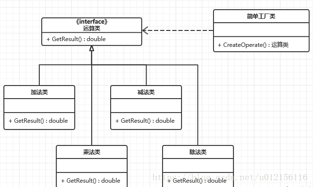
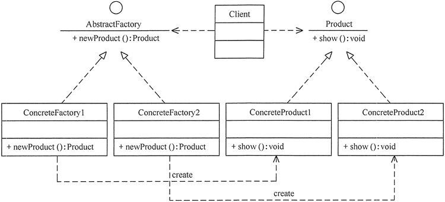
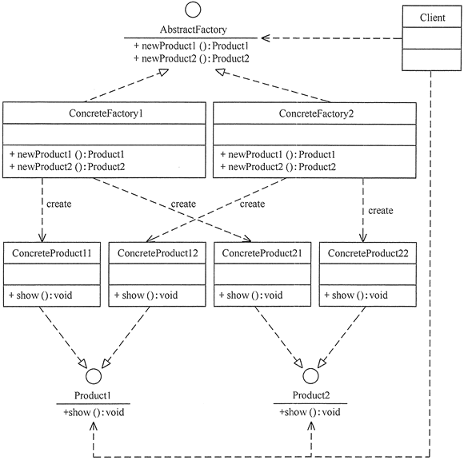

使用背景：实例化对象的时候不再使用 new Object()形式，可以根据用户的选择条件来实例化相关的类。对于客户端来说，去除了具体的类的依赖。只需要给出具体实例的描述给工厂，工厂就会自动返回具体的实例对象
简单工厂模式：

不赘述代码
工厂方法模式：
一个具体工厂对应一个具体类型

```
package FactoryMethod;
public class AbstractFactoryTest
{
    public static void main(String[] args)
    {
        try
        {
            Product a;
            AbstractFactory af;
            af=(AbstractFactory) ReadXML1.getObject();
            a=af.newProduct();
            a.show();
        }
        catch(Exception e)
        {
            System.out.println(e.getMessage());
        }
    }
}
//抽象产品：提供了产品的接口
interface Product
{
    public void show();
}
//具体产品1：实现抽象产品中的抽象方法
class ConcreteProduct1 implements Product
{
    public void show()
    {
        System.out.println("具体产品1显示...");
    }
}
//具体产品2：实现抽象产品中的抽象方法
class ConcreteProduct2 implements Product
{
    public void show()
    {
        System.out.println("具体产品2显示...");
    }
}
//抽象工厂：提供了厂品的生成方法
interface AbstractFactory
{
    public Product newProduct();
}
//具体工厂1：实现了厂品的生成方法
class ConcreteFactory1 implements AbstractFactory
{
    public Product newProduct()
    {
        System.out.println("具体工厂1生成-->具体产品1...");
        return new ConcreteProduct1();
    }
}
//具体工厂2：实现了厂品的生成方法
class ConcreteFactory2 implements AbstractFactory
{
    public Product newProduct()
    {
        System.out.println("具体工厂2生成-->具体产品2...");
        return new ConcreteProduct2();
    }
}
```
抽象工厂模式：
一个具体工厂对应一类具体类型

